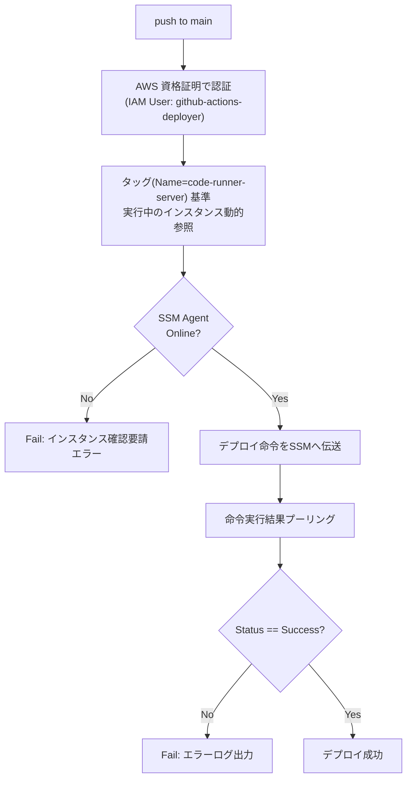
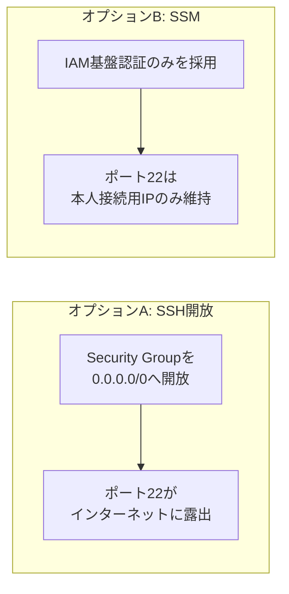

# .github/workflows/ — CI/CD Pipeline
GitHub Actionsを用いてCI/CDを実装しました。
AWS EC2インスタンスへの自動デプロイを含みます。
 
## デプロイ流れ
 


`main` ブランチへpushされるとGitHub Actionsが自動的にデプロイします. SSHを通した直接接続の代わりにAWS Systems Manager(SSM)を使用し, EC2の22番ポートをCIランナーに開放しなくとも命令を遠隔で実行します。
 
## 必要なGitHub Secrets
 
| Secret名 | 用途 |
|---|---|
| `DEPLOY_AWS_ACCESS_KEY_ID` | GitHub ActionsがAWS API(SSM, EC2)を呼び出すためのIAM UserのAccess Key |
| `DEPLOY_AWS_SECRET_ACCESS_KEY` | 上記Access KeyのSecret |
 
> `EC2_INSTANCE_ID`は登録しません。 インスタンスを再生成(destroy/apply)するたびにIDが変わるため, タッグ基準でワークフローが毎回動的に参照します。
 
## デプロイ用IAM User権限
 
`github-actions-deployer`という名前の専用IAM Userを作成し, 以下の最小権限のみを与えます (`AdministratorAccess`を与えない):
 
```json
{
  "Version": "2012-10-17",
  "Statement": [
    {
      "Effect": "Allow",
      "Action": [
        "ssm:SendCommand",
        "ssm:GetCommandInvocation",
        "ssm:ListCommandInvocations",
        "ssm:DescribeInstanceInformation",
        "ec2:DescribeInstances"
      ],
      "Resource": "*"
    }
  ]
}
```
 
## SSM選択理由
 

 
GitHub Actionsランナーは毎度違うIPから接続するため、Security Groupを特定IPのみ許容する方式とは合いませんでした。セキュリティ隔離をプロジェクトの重要事項としているため、デプロイ経路で不必要なポート開放を避けるためSSM方式を採用しました。
 
## Secret登録方法
 
```bash
gh secret set DEPLOY_AWS_ACCESS_KEY_ID
gh secret set DEPLOY_AWS_SECRET_ACCESS_KEY
```
 
登録されたsecret目録確認 (値はマスキングされ表示されない):
```bash
gh secret list
```