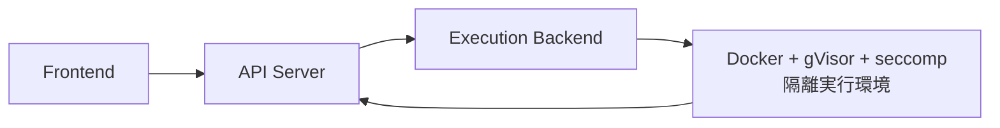

# WEB Code Runner  

>Web上でコードを実行するコードランナープロジェクトです。  
>ユーザーが提出したコードを隔離された環境で実行し、実行結果を返還します。
---

# Demo

準備中（EC2デプロイ検証・GitHub Pages接続確認後に追記予定）

---

# Features

- 複数言語対応（Node.js / Python）
- Monaco Editorによるシンタックスハイライト付きコードエディタ
- 複数テストケース入力・一括判定（最大10件）
- AC / WA / TLE / RE による判定結果表示
- Docker + gVisor + seccompによる多層防御サンドボックス実行
- Terraformによるインフラのコード化（VPC / EC2 / IAM）
- GitHub Actions + AWS SSMによるCI/CDパイプライン

---

# Architecture Overview

---

# Specific architecture readme
---
## Frontend architecture  
[frontend README](./frontend/README.md)

## Backend architecture  
[backend README](./src/README.md)

## Devops architecture
[Devops README](./terraform/README.md)

## Deploy steps
[Deploy README](./.github/workflows/README.md)

# Tech Stack

## Frontend

- React
- Vite
- TypeScript
- Monaco Editor

## Backend

- TypeScript
- Hono
- Docker

## Devops

- Terraform

## Cloud

- AWS EC2

## Deployment

- GitHub Actions

---

# Challenge

## 

---

## 

---

## 

---

# Goals

- 
- 
- 
- 
- 
- 
- 

---