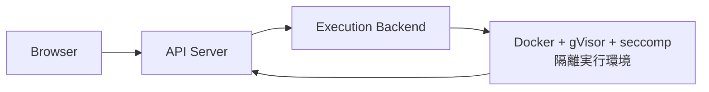

# WebGPU Simulation  

>Web上でコードを実行するコードランナープロジェクトです。  
>ユーザーが提出したコードを隔離された環境で実行し、実行結果を返還します。
---

# Demo

---

# Features

- 
- 
- 
- 
- 
- 
- 

---

# Architecture Overview

---

# Backend architecture  

---

# Deploy steps

---

# Tech Stack

## Backend

- TypeScript
- Hono
- Docker
- Terraform

## Cloud

- AWS EC2

## Deployment

- GitHub Actions

---

# Challenge

## 

---

## 

---

## 

---

# Goals

- 
- 
- 
- 
- 
- 
- 

---
