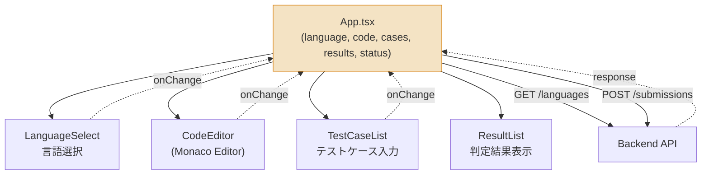
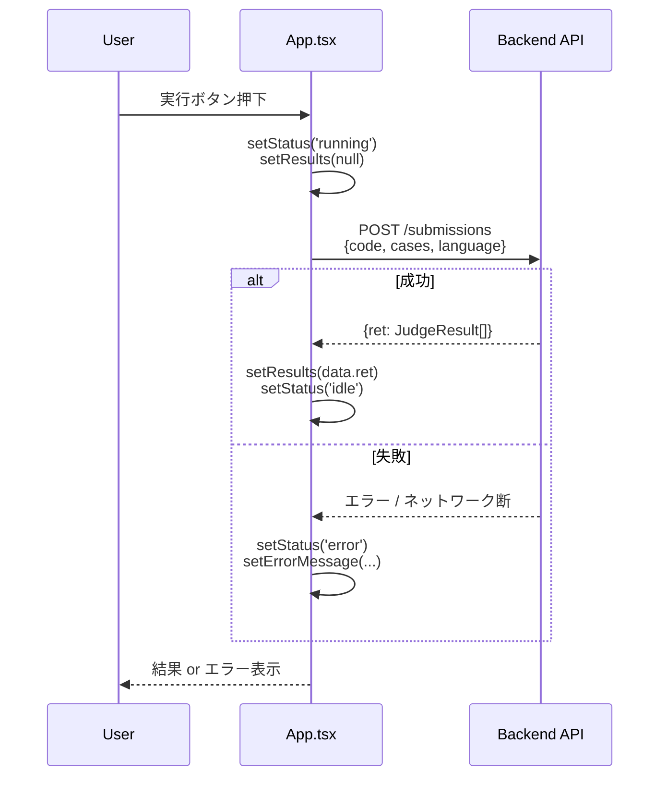

# WEB Code Runner - Frontend

>WEB Code RunnerプロジェクトのFrontendの内部リファレンスです。

---

## Architecture Overview

React + Viteで構築したSPA。状態管理ライブラリは使わず、`App.tsx`を単一の状態所有者（single source of truth）として、各コンポーネントはpropsで値を受け取りcallbackで変更を通知するcontrolledパターンで統一している。



各子コンポーネントは自身の状態を持たない。`language`が変わればMonaco Editorのsyntax highlightingが連動し、`results`が埋まればResultListがAC/WA/TLE/RE判定を描画する。

---

## ファイルリファレンス

| ファイル | 役割 |
|---|---|
| `src/App.tsx` | 状態所有者（composition root相当）。全コンポーネントの配置と、`/submissions`へのfetchロジックを保持。 |
| `src/components/LanguageSelect.tsx` | `/languages`をfetchし、対応言語のドロップダウンを描画。 |
| `src/components/CodeEditor.tsx` | Monaco Editorのラッパー。`language`propを内部でMonaco用の言語IDにマッピング（例: `node` → `javascript`）。 |
| `src/components/TestCaseList.tsx` | テストケース（stdin/stdout）の追加・削除・編集UI。1〜10件。 |
| `src/components/ResultList.tsx` | `/submissions`のレスポンス（`VerdictType`: AC/WA/TLE/RE）をバッジ表示。 |
| `vite.config.ts` | ビルド設定。`base`（GitHub Pagesのサブパス対応）、`server.proxy`（ローカル開発時のバックエンド転送先）を定義。 |

---

## 状態フロー — コード実行時



実行のたびに`setResults(null)`で前回の結果を一度クリアしてからfetchする。連続実行時に古い結果が画面に残るのを防ぐため。

---

## Tech Stack

- **Framework**: React
- **Build Tool**: Vite
- **Language**: TypeScript
- **Editor**: Monaco Editor (`@monaco-editor/react`)
- **Deployment**: GitHub Pages（GitHub Actions経由）

---

## Local Setup

```bash
cd frontend
npm install
npm run dev
```

ローカルでバックエンドとの疎通確認をする場合、リポジトリルートでバックエンドも別途起動しておく必要がある（`npm install && npm run dev`、ルート`README.md`参照）。

### 本番ビルドの確認

```bash
npm run build
npm run preview
```

`base`設定込みでビルドされたアセットパスが正しく機能するか、ローカルで確認できる。