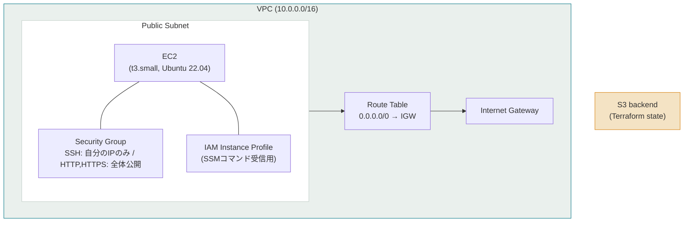
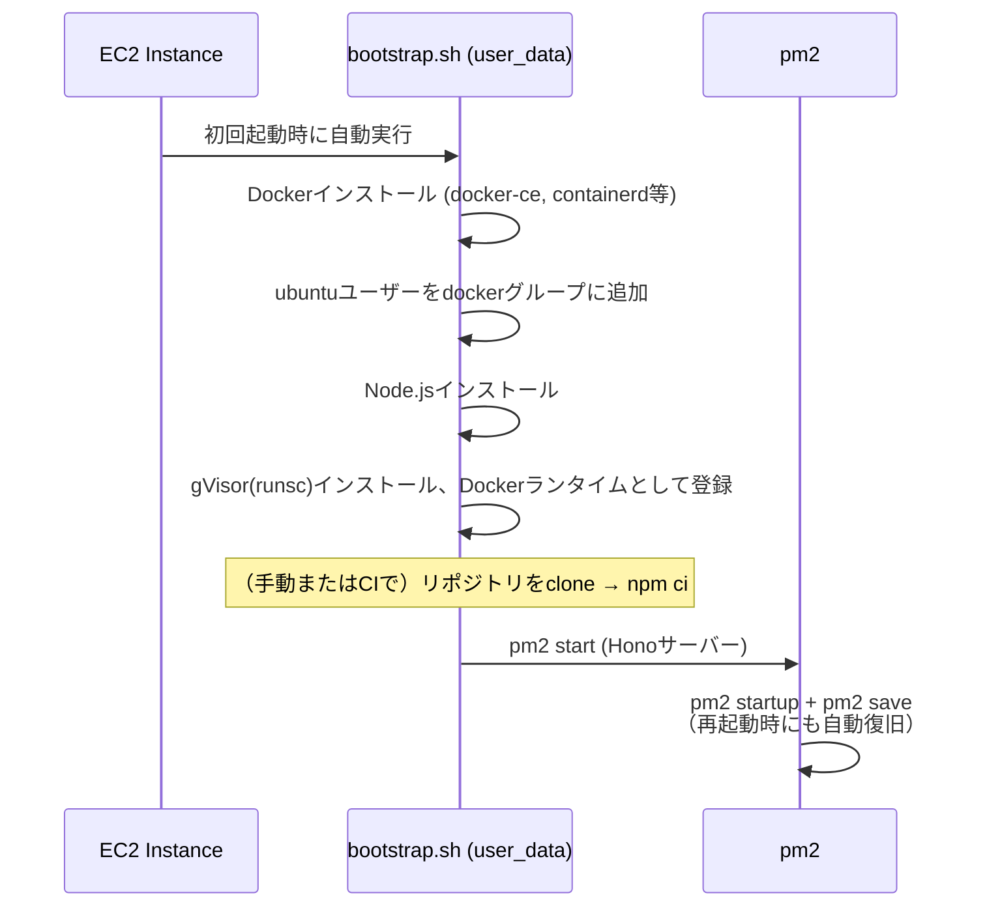
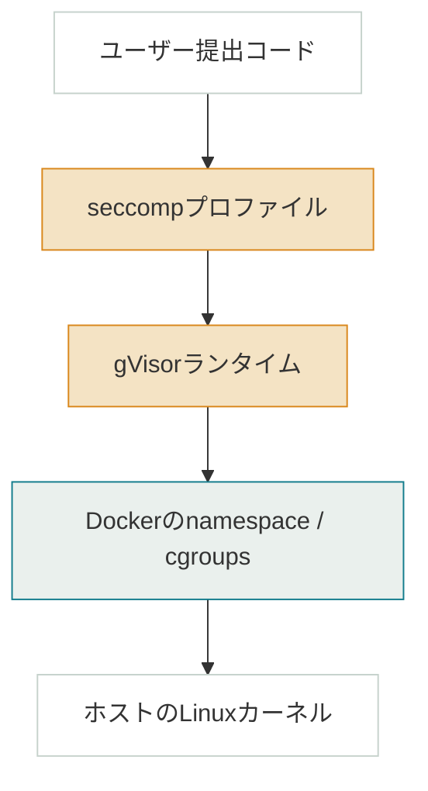

# WEB Code Runner - Infrastructure

>WEB Code RunnerプロジェクトのInfrastructureの内部リファレンスです。

---

## Architecture Overview

AWSインフラをTerraformで管理している。VPC内のPublic Subnetに単一のEC2インスタンスを配置し、Docker実行環境をその上に構築する構成。



Stateは`S3 backend`（`code-runner-tfstate-*`）でリモート管理している。

---

## ファイルリファレンス

| ファイル | 役割 |
|---|---|
| `main.tf` | Provider、S3 backendの設定。 |
| `vpc.tf` | VPC、Subnet、IGW、Route Table。 |
| `security_groups.tf` | インバウンド/アウトバウンドのルール。SSHは`my_ip_cidr`一件のみ許可。 |
| `ec2.tf` | AMI検索、Key Pair、IAM Role/Instance Profile、EC2インスタンス本体。 |
| `variables.tf` | 入力変数（`my_ip_cidr`、`ssh_public_key_path`等）。 |
| `outputs.tf` | Public IP、Instance ID、SSH接続コマンドの出力。 |
| `scripts/bootstrap.sh` | EC2初回起動時にDocker、Node.js、gVisor、strace(検証用)をインストール。 |

---

## Bootstrap Flow

EC2起動からサーバー起動までの流れ。`bootstrap.sh`は`user_data`として初回起動時に一度だけ実行される。



デバッグ時は以下を使う（`bootstrap.sh`冒頭にも記載）。

| コマンド | 用途 |
|---|---|
| `cloud-init status` | cloud-initの現在の実行状態を確認。 |
| `sudo bash /var/lib/cloud/instance/scripts/part-001` | スクリプトを手動で再実行。`-x`により各コマンドが実行時に出力されるため、どこで失敗したかを特定できる。実質もっとも使用頻度が高い。 |
| `cat /var/log/code-runner-bootstrap.log` | 完了確認用。スクリプトの最終行でのみ書き込まれるため、失敗原因の特定には使えない。 |

---

## Isolation Layer

コード実行そのもの（`ExecutionBackend`によるコンテナ起動、`CodeJudge`によるオーケストレーション等）は`src/README.md`を参照。ここでは、そのコンテナがホストからどう隔離されているかのみを扱う。



| 層 | 機構 | 対象 |
|---|---|---|
| seccomp | Docker標準プロファイル + 明示的deny-list（ptrace, mount, bpf, kexec_load等） | 危険なsyscallの直接呼び出し |
| gVisor (runsc) | syscallをユーザースペースで横取りするアプリケーションカーネル | ホストカーネル脆弱性への到達 |
| Docker isolation | `--network none` `--read-only` `--tmpfs noexec` `--memory` `--cpus` `--pids-limit` `--cap-drop ALL` `--security-opt no-new-privileges` | 通信、ファイル改ざん、リソース枯渇、fork bomb、権限昇格 |
| Host kernel | AWS Nitro上のEC2 | 最終防衛線 |

各層は独立して破られうる前提で積んでいる。単一層の突破 ≠ 脱出。

### seccompプロファイルの設計判断

当初は対象ランタイムの`strace`出力のみを根拠に、ゼロから許可リストを構築していた。この方式ではコンテナ生成自体が失敗する — `strace`は`execve`でプロセスイメージが置き換わった後のsyscallしか観測できないため、`runc`自身の初期化処理（マウント名前空間の準備、`fsmount`/`fsconfig`等）が可視化されず、リストから漏れる。ユーザーコード実行以前の、ランタイム自身の内部処理がプロファイルに拒否される結果になった。

現行の構成はDocker標準プロファイルをベースに、このプロジェクトで正当な用途のないsyscall（`ptrace`, `mount`, `bpf`, `kexec_load`, `init_module`等）を明示的にdeny-listとして追加する方式。Node.js/Pythonで同一プロファイルを共有している — 標準プロファイルの時点で両ランタイムに必要なsyscallは既にカバーされているため、言語ごとの再選別は不要だった。

プロファイル本体は`src/infra/seccomp-profiles/`を参照。

---

## セキュリティ検証

フラグが正しく渡っていることの確認はユニットテストで完了している（`sandbox.test.ts`）。統合テストでは、各境界を実際に侵害しようとするコードを送信し、ブロックされることをend-to-endで確認する（`docker-execution-backend.security.integration.test.ts`）。

| テストケース | 検証対象 |
|---|---|
| fork bomb | `--pids-limit` |
| ファイル書き込み試行 | `--read-only` |
| 外部通信試行（DNS解決含む） | `--network none` |
| 過大メモリ確保 | `--memory`（OOM kill） |
| 無限ループ | `timeout -s KILL` |
| `ptrace`呼び出し試行 | seccompプロファイル |
| `setgroups`（`CAP_SETGID`要求） | `--cap-drop ALL` |
| 同時セッション5並列 | 基本的な安定性 |

ドメイン名（`example.com`）宛のリクエストを使ったネットワークテストは、当初失敗ではなく無期限にハングした。原因は`--network none`がDNS解決自体をブロックしており、コード側のタイムアウトハンドラが作動する段階（ソケット確立後）に到達できないため — 最終的にはコンテナ側の`timeout -s KILL`で強制終了された。ネットワーク分離が想定より厳格に効いていたことの証左であり、テスト側の不具合ではない。IPアドレス直指定に変更し、決定的かつ高速に失敗するよう修正した。

### 未対応・既知の制約（M4以降）

- **コンパイル言語（C++）**: コンパイル段階と実行段階で許容すべきsyscallの集合が大きく異なる。`sandbox.ts`の`/tmp`は`noexec`マウントのため、コンパイル直後のバイナリをその場で実行できない制約とも絡む。コンパイル用/実行用コンテナ分離の設計を要し、対応を見送っている。
- **gVisor下でのCI実行**: 上記の統合テストは`runc`に対して実行している。`runsc`自体の動作はCLIで別途確認済み。これらの防御機構はDocker/seccompレベルでランタイム非依存のため、`runsc`下でも同一結果になる想定だが未実証。リポジトリを公開しCIがprivateイメージを取得できるようになってから実行する。
- **tmpfs化**: 現状、コードとコンパイル成果物はセッション終了（`close()`）までホストディスク（`os.tmpdir()`）を経由する。`tmpfs`（RAM上）への切り替えで露出時間をさらに縮小できる。
- **deny-listの網羅的検証**: 拒否対象20 syscallのうち、代表として`ptrace`のみを直接テストしている。目的は機構自体の動作確認であり、全項目の個別再検証ではない。

### 脅威モデル

想定しているのは、高トラフィック・高価値ターゲットではないポートフォリオプロジェクトとしての現実的な脅威 — 悪意はあるが場当たり的なコード（fork bomb、サンドボックス脱出の試行）であり、ハイパーバイザー自体を狙う国家レベルの0-dayではない。各層は「絶対に破られない」ことを主張するものではなく、脱出に必要なコストを積算的に引き上げることを目的としている。

---

## Deployment

EC2にはSSHポートに加え、AWS SSM経由でもコマンドを受け取れるようIAM Roleを付与している。CI/CDがSSHを使わずデプロイするための仕組み。詳細は[`.github/workflows/README.md`](../.github/workflows/README.md)を参照。

---

## Local Setup

```bash
cd terraform
cp terraform.tfvars.example terraform.tfvars
# my_ip_cidr, ssh_public_key_path を入力

terraform init
terraform plan
terraform apply
```

### リソースの削除（コスト管理）

```bash
terraform destroy   # 全リソース削除
```

インスタンスのみ一時停止する場合:

```bash
aws ec2 stop-instances --instance-ids $(terraform output -raw instance_id)
```

コスト管理のため、インスタンスは普段停止している。デモが必要な場合はIssue等で連絡があれば起動する。

---

## Tech Stack

- **IaC**: Terraform
- **Cloud**: AWS（EC2, VPC, IAM, SSM, S3）
- **Isolation**: Docker, gVisor (runsc), seccomp
- **CI/CD**: GitHub Actions + AWS SSM