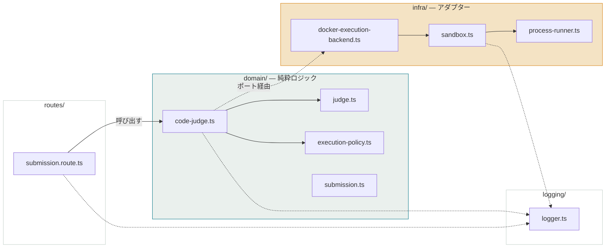
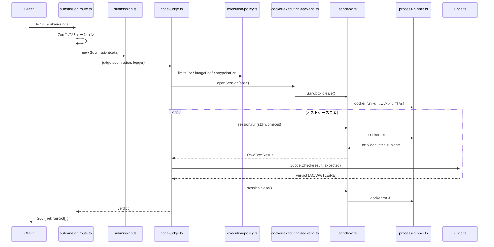
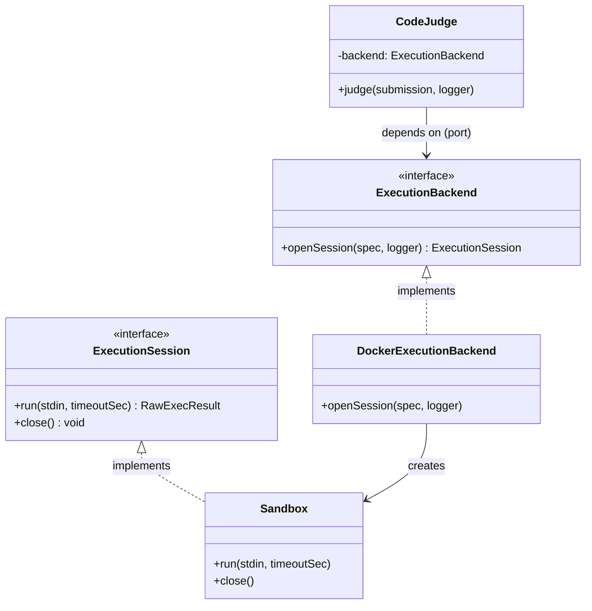

# WEB Code Runner - Backend  

>WEB Code RunnerプロジェクトのBackendの内部リファレンスです。
---

## Architecture Overview

4つのディレクトリに責任を分離しています。
`routes`は`domain`に依存し, `domain`は`infra`をポートとしてインタフェースを実行します。
`infra`では`domain`でのポートを実装します。

| レイヤー | 責務 |
|---|---|---|
| `routes/` | HTTP関連の処理：リクエスト解析、バリデーション、domain呼び出し、レスポンス整形 | 
| `domain/` | 判定ルール、オーケストレーション、データモデル | 
| `infra/` | 実際の実行メカニズム（現状はDocker） | 
| `logging/` | リクエスト単位で追跡できる構造化ログ | 

---

## リクエストのライフサイクル
 
`POST /submissions` 処理：
 

コンテナ自体は提出1件につき1回だけ作成され（`docker run -d`）、以降のテストケースは同じコンテナに対する`docker exec`で処理される。

---

## ファイルリファレンス
 
### `routes/`
| ファイル | 役割 |
|---|---|
| `submission.route.ts` | 入力検証、`CodeJudge`の呼び出し、例外（`ValidationError`、`ExecutionInfraError`）をHTTPステータスへマッピング。 |
 
### `domain/`
| ファイル | 役割 |
|---|---|
| `submission.ts` | 検証済みリクエストを、IDを持つ不変のドメインオブジェクトへラップ。 |
| `execution-policy.ts` | 言語 → `{ image, entrypoint, resourceLimits }` の静的マッピング。言語固有の設定が集約される唯一の場所。 |
| `judge.ts` | 純粋関数：`(RawExecResult, expected) → verdict`。優先順位はタイムアウト → 異常終了 → 出力不一致 → AC。I/Oなしで完全にユニットテスト可能。 |
| `code-judge.ts` | オーケストレーター。セッションを開き、テストケースをループ処理し、各々を判定し、`finally`でセッションのクローズを保証する。 |
| `execution-backend.ts` | ポート。 `ExecutionBackend` / `ExecutionSession` を定義。`openSession → run × N → close`の順序に従う。 |
 
### `infra/`
| ファイル | 役割 |
|---|---|
| `docker-execution-backend.ts` | 提出コードを一時ファイルへ書き出し、セッション生成を`Sandbox`へ委譲。生成前の失敗時のクリーンアップも担当。 |
| `sandbox.ts` | Docker固有のアダプター。コンテナのライフサイクル全体（セキュリティフラグ、bind mount、ケースごとの`docker exec`、原因不明の失敗時の`docker inspect`、`docker rm -f`）を管理。 |
| `process-runner.ts` | `child_process.spawn`を薄くラップ。アプリ内のすべてのサブプロセス呼び出しがここを通る — `'error'`ハンドラも含めて一箇所に集約されているため、同種の欠陥（リスナー漏れによるクラッシュ）が別の呼び出し箇所で再発しない。 |
 
### `logging/`
| ファイル | 役割 |
|---|---|
| `logger.ts` | 最小限の`Logger`インターフェースを実装した`ConsoleLogger`。`.child(context)`で`requestId`や`containerName`などのフィールドを付与すると、以降のネストしたログ呼び出しで再指定不要のまま伝播する。 |

### コンポジションルート
| ファイル | 役割 |
|---|---|
| `app-dependencies.ts` | ルートが必要とするものの型定義（`{ codeJudge, logger }`）。実装は持たない。 |
| `app.ts` | `AppDependencies`を受け取り、Honoインスタンスにルートを組み込む。 |
| `index.ts` | 具象インスタンス（`ProcessRunner` → `DockerExecutionBackend` → `CodeJudge`）を実際に組み立て、サーバーを起動する唯一の場所。グローバルなシングルトンは存在せず、すべて明示的に注入される。 |

## ポート・アダプターの境界
 

 
`ExecutionBackend`が存在する理由は、`CodeJudge`が「コードがどう実行されるか」を一切知らなくて済むようにするため — セッションを開き、stdinをN回流し、閉じられることだけを知っていればよい。この境界のおかげで、サンドボックスの実行モデル（ケースごとにコンテナを作る方式 → 提出ごとに1コンテナを作り`docker exec`で使い回す方式）を変更した際も、`CodeJudge`・`Judge`・ルート層には一切手を入れずに済んだ。
 
将来2つ目のオーケストレーター（例：インタラクティブなターミナルセッション）を追加する場合も、同じポートを再利用できる想定 — `openSession`/`run`/`close`はすでに「バッチ判定」の枠を超えて一般化されている。
 
---
 
## 新しい言語への対応
 
対応が必要な箇所、順番に：
 
1. `schema.ts` — `LanguageSchema` のenumに言語を追加。
2. `execution-policy.ts` — `limitsFor`、`imageFor`、`entrypointFor`にcaseを追加。
3. 対応する`runner-<lang>:latest`のDockerfileを作成（最小構成 — 提出コードの実行に必要な範囲のみ）。
4. `sandbox.ts` — `extensionFor`が新しいentrypointを正しい拡張子へマッピングするようにする。
5. コンパイルが必要な言語の場合（C++など）：サンドボックスの`/tmp`は`noexec`でマウントされているため、コンパイル直後のバイナリをそこで実行できない。動作させるには明示的な設計判断が必要
---
 
## テスト
 
| コマンド | 対象 | Dockerが必要か |
|---|---|---|
| `npm test` | `*.test.ts` — 純粋なユニットテスト（`judge.test.ts`、フェイクを使った`code-judge.test.ts`、フェイクの`ProcessRunner`を使った`sandbox.test.ts`） | 不要 |
| `npx vitest run --config vitest.integration.config.ts` | `*.integration.test.ts` — `runner-node:latest`に対して実コンテナを起動して検証 | 必要（事前にイメージのビルドが必要） |
 
`code-judge.test.ts`は`FakeExecutionBackend`/`FakeSession`を使い、Dockerに一切触れずにオーケストレーションロジック（例外発生時でも必ずセッションが閉じられること）を検証している。
 
---

## Tech Stack

- **runtime**:Node.js, TypeScript
- **web framework**:Hono
- **isolation**:Docker (CLI, invoked via `child_process`)
- **validation**:Zod
- **testing**:Vitest (unit tests for judging logic, integration tests against real containers)

---