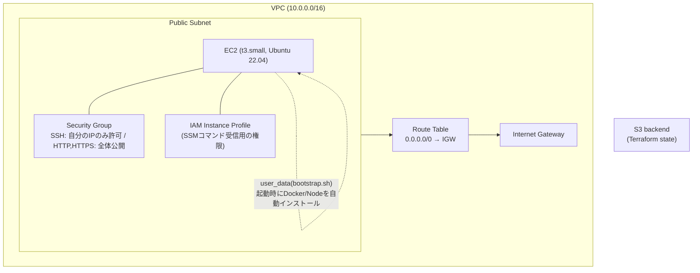
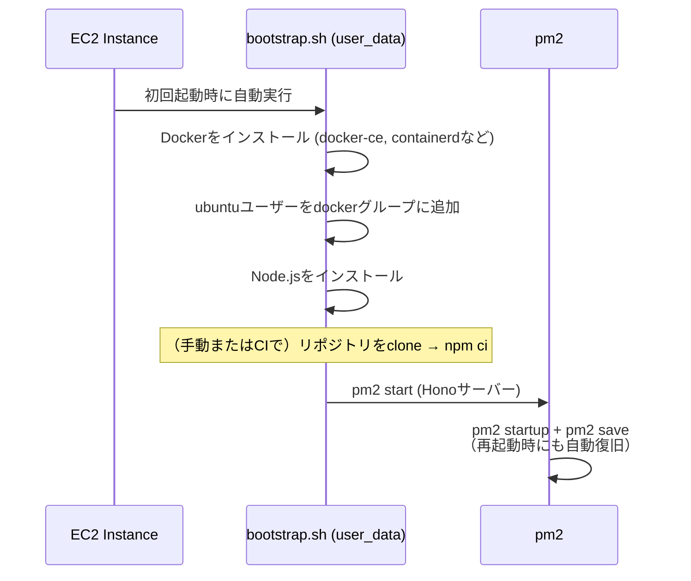
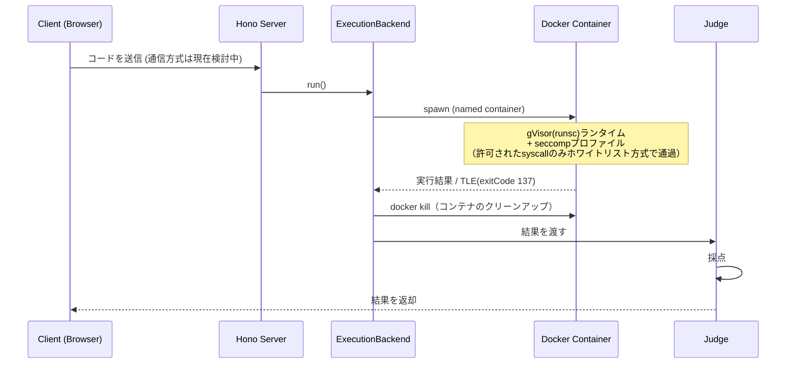

# terraform/ — インフラ構築とバックエンド実行フロー
 
AWSインフラをTerraformで管理しています。
 
## Terraformが作成するリソース
 

 
Stateファイルは、S3 backend(`code-runner-tfstate-*`)でリモート管理しています。
 
### ファイル構成
 
| ファイル | 役割 |
|---|---|
| `main.tf` | Provider、S3 backendの設定 |
| `vpc.tf` | VPC、Subnet、IGW、Route Table |
| `security_groups.tf` | インバウンド/アウトバウンドのルール |
| `ec2.tf` | AMIの検索、Key Pair、IAM Role/Instance Profile、EC2インスタンス |
| `variables.tf` | 入力変数（自分のIP、SSHキーのパスなど） |
| `outputs.tf` | Public IP、Instance ID、SSH接続コマンドの出力 |
| `scripts/bootstrap.sh` | EC2初回起動時にDocker + Node.jsをインストール |
 
## ローカルでの実行方法
 
```bash
cd terraform
cp terraform.tfvars.example terraform.tfvars
# my_ip_cidr, ssh_public_key_path の値を入力
 
terraform init
terraform plan
terraform apply
```
 
## バックエンド起動の流れ（EC2起動 〜 サーバー起動まで）
 

 
## コード実行リクエストの処理フロー（Dockerによる隔離）
 

 
> gVisor/seccompの詳細設定は、M3.3で追加予定です。
 
## SSMアクセス（デプロイ用）
 
EC2には、SSHポート以外にAWS SSM経由でもコマンドを受け取れるよう、IAM Roleが付与されています。これはCI/CDがSSHを使わずにデプロイするための仕組みです。詳細は [`.github/workflows/README.md`](../.github/workflows/README.md)（準備中）を参照してください。
 
## リソースの削除（コスト管理）
 
```bash
terraform destroy   # 全リソースを削除
```
 
インスタンスのみ一時停止する場合:
```bash
aws ec2 stop-instances --instance-ids $(terraform output -raw instance_id)
```
 
## 7. 稼働状況について
 
コスト管理のため、インスタンスは普段停止しています。デモをご覧になりたい場合は、Issueなどでご連絡いただければ即座に起動いたします。